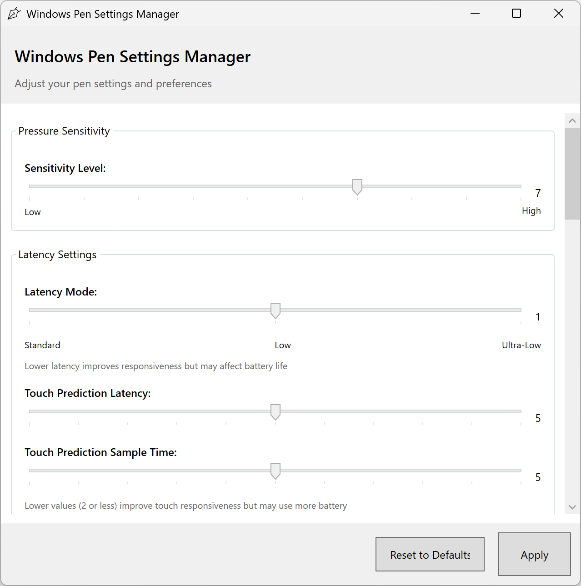

# Windows Pen Settings Manager

A powerful tool for managing Windows pen settings through the registry, providing enhanced control over your Windows pen experience. This application makes it easy to configure pen settings that are normally difficult to access.



## Features

- **Complete pen settings management** from multiple registry locations
- **User-friendly interface** with sliders and checkboxes for easy configuration
- **Pressure sensitivity adjustment** to customize how the pen responds to pressure
- **Latency settings** to reduce input lag for a more responsive experience
- **Double-tap configuration** for precise control over double-tap behavior
- **Right-click settings** including pen button configuration and hold gestures
- **Immediate feedback** - changes are applied instantly
- **Advanced settings** for full control of the pen experience

## Registry Settings Managed

The application provides access to the following registry keys:

- `HKEY_CURRENT_USER\Software\Microsoft\Wisp\Pen`
- `HKEY_CURRENT_USER\Software\Microsoft\Wisp\Pen\SysEventParameters`
- `HKEY_CURRENT_USER\Software\Microsoft\Windows NT\CurrentVersion\Windows\Pen`
- `HKEY_CURRENT_USER\Control Panel\Cursors`
- `HKEY_LOCAL_MACHINE\SOFTWARE\Microsoft\TouchPrediction`
- `HKEY_CURRENT_USER\SOFTWARE\Microsoft\Windows\CurrentVersion\PrecisionTouchPad`

## Requirements

- Windows 10 or Windows 11
- .NET 8.0 or higher
- Administrator privileges (required for registry modifications)

## Installation

1. Download the latest release from the [Releases](https://github.com/wjc911/windows-pen-settings-manager/releases) page
2. Extract the ZIP file to any location
3. Run `PenSettingsManager.exe` as administrator

## Building from Source

1. Clone the repository
   ```
   git clone https://github.com/wjc911/windows-pen-settings-manager.git
   ```

2. Open the solution in Visual Studio 2022 or later

3. Build the solution using one of these methods:
   
   **Using Visual Studio:**
   - Right-click on the project and select "Build"
   - Or press Ctrl+Shift+B

   **Using Command Line:**
   ```
   dotnet restore
   dotnet build
   ```

4. To create a release build:
   ```
   dotnet publish -c Release -r win-x64 --self-contained false
   ```

5. The compiled application will be in the `bin\Debug\net8.0-windows` or `bin\Release\net8.0-windows` directory

For more detailed build instructions, see the [BUILD_INSTRUCTIONS.md](BUILD_INSTRUCTIONS.md) file.

## Contributing

Contributions are welcome! Please feel free to submit a Pull Request.

1. Fork the project
2. Create your feature branch (`git checkout -b feature/amazing-feature`)
3. Commit your changes (`git commit -m 'Add some amazing feature'`)
4. Push to the branch (`git push origin feature/amazing-feature`)
5. Open a Pull Request

## License

This project is licensed under the MIT License - see the [LICENSE](LICENSE) file for details.

## Acknowledgments

- Special thanks to all contributors
- Inspired by the need for better pen settings management in Windows 